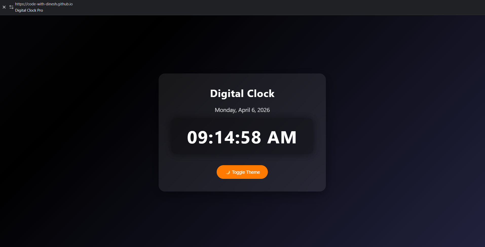

# ⏰ Digital Clock

A simple digital clock built using HTML, CSS, and JavaScript.

## 🚀 Features

- Live Digital Clock
- AM/PM Format
- Current Date Display
- Dark/Light Mode Toggle
- Modern UI Design

## 🛠️ Tech Used

- HTML
- CSS
- JavaScript

## 📸 Preview

## 🌐 Live Demo
 https://code-with-dinesh.github.io/day-3-digital-clock/
